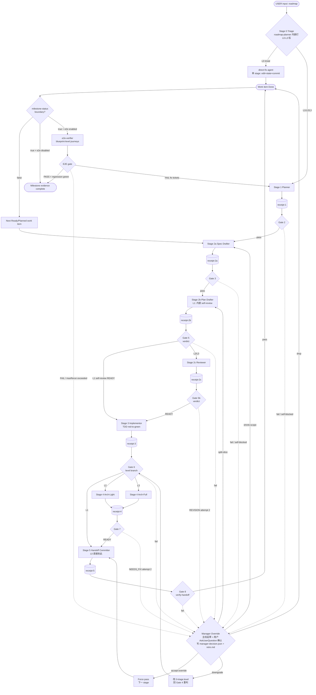

# Pipeline Flow · v5.1 简化主流程图

> 何时读本文：你想搞清楚"工单从 roadmap 到 Done 走了哪些 stage、Gate fail 怎么处理"。

## 主流程（简化版）



读图要点：

- 虚线（`-.->`）= "fail / self-blocked → Manager"，包含两种触发：(1) attempt > maxRetry+1 (默认 attempt > 2) (2) sub-agent return blocked=true 含非空 evidence
- 每个 Gate 实线 fail 表示**首次 fail** → 主线自动 retry 一次（attempt++）；retry 后仍 fail 才走虚线进 Manager
- `milestone-status` 是 Stage 5 之后的确定性边界脚本；只有 `boundary_reached=true` 才能派 e2e-verifier
- E2E FAIL 默认回流为带 `source=e2e-fail / milestone / journey_id` 的 Planned 修复工单；同一 `(milestone, journey_id)` 查重复用，超过 `e2e.maxRerun` 才进 Manager
- Manager Override 5 个 action 中：
  - `accept-override` → 跳到 S5 / 下一 stage
  - `downgrade` → 改 0-triage.level，**回 Gate 6 重判 level branch**（不直跳 S3，保留 reviewer）
  - `shrink-scope` → S2a retry（加 §3 不做项）
  - `split-slice` → S2b retry（声明 sub-slice）
  - `drop` → Done (queue Superseded)
- Gate 8 (handoff verify) fail 只允许 Manager `accept-override` 或 `drop`

## 4 档 Level 路径对比

| Level | Stage 序列 | 跳过 |
|---|---|---|
| L0 | direct-fix → Done | 跳 spec/plan/review/arch |
| L1 | 1 → 2a → 2b(含 self-review) → 3 → 5 | 跳 2c-reviewer + 4-arch |
| L2 | 1 → 2a → 2b → 2c → 3 → 4-light → 5 | reviewer/arch 走轻量（不调 architecture skill） |
| L3 | 1 → 2a → 2b → 2c → 3 → 4-full → 5 | 完整 7 stage |

## Retry 模式

每个 Gate fail 自动 retry × 1（`pipeline.maxRetry` 默认 1）：

1. 主线把 fail_items + reviewer_expectation 写到 `pipeline-status.last_feedback`
2. 派 fresh sub-agent 到上游 stage（receipt 2c-review.target_stage_if_revision 字段决定回 spec 还是 plan）
3. Sub-agent 读 `{{lastFeedback}}` + 自己上轮 receipt，针对性修正
4. 新一轮 receipt 再过 Gate
5. 仍 fail → Manager Override

## Sub-agent 自报阻塞 · 短路

任一 sub-agent 在 return payload 中设 `blocked: true` + 非空 `blocked_evidence` → 跳过 retry，直接进 Manager Override。

**空 evidence** 视为偷懒早退，主线打回原 stage 重派一次（不计入 attempt）。

## 交付失败（returned-but-unusable）· 自愈 — 区别于"自报阻塞"

不变量 10：Agent **返回了**但末条不是合法 receipt JSON（散文 / 529 报错串 / 空 / 截断）→ 这不是质量失败也不是自报阻塞，是**交付层**问题，主线**自愈不惊动人**：

```
fresh 重派 1 次（不计 gate attempt）→ 仍不可用 → 主线内联接手（标 dispatch_recovery，
内联代跑 implementor 仍守不变量 3/4）→ 主线也做不动 → 才 Manager Override
```

**边界**：进程级真 hang（主线同步阻塞）本协议测不了，依赖 harness 的 Agent 超时回收。三类失败一图分清：

- 质量失败（receipt 合法没过 gate）→ retry-once → Manager（人）
- 自报阻塞（blocked:true + 证据）→ 直进 Manager（人）
- **交付失败（没拿到可用 receipt）→ 先自愈（机器），才到人**

## 与 BOARD.html 的关系

每条工单的 `pipeline-status.json` 由主线维护，`render-board.mjs` 扫描 `<devRoot>/work/*/receipts/pipeline-status.json` 聚合成 `[05] PIPELINE STATUS` 工单清单 panel：

```
WorkID    Level  Status         Stage         Note
─────     ─────  ─────────      ─────────    ─────────────
IS-009    L3     BLOCKED        2c-review    awaiting Manager
IS-010    L2     In Progress    3-impl       retry 1/1
```

BOARD **不**展示 stage 内部细节（gate history / receipt diff）——那些留作独立后期工具，从 receipts/ 聚合渲染。
